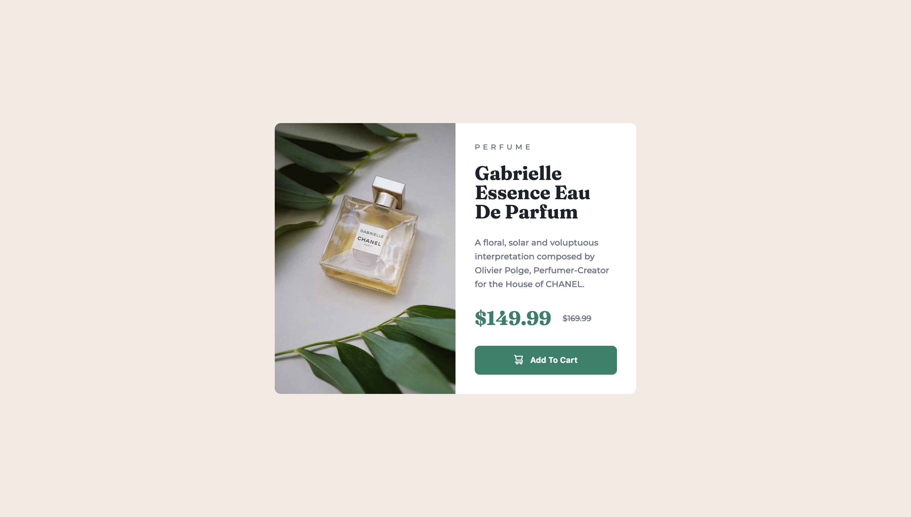

# Frontend Mentor - Product preview card component solution

This is a solution to the [Product preview card component challenge on Frontend Mentor](https://www.frontendmentor.io/challenges/product-preview-card-component-GO7UmttRfa). Frontend Mentor challenges help you improve your coding skills by building realistic projects. 

## Table of contents

- [Overview](#overview)
  - [The challenge](#the-challenge)
  - [Screenshot](#screenshot)
  - [Links](#links)
- [My process](#my-process)
  - [Built with](#built-with)
  - [What I learned](#what-i-learned)

## Overview

### The challenge

Users should be able to:

- View the optimal layout depending on their device's screen size
- See hover and focus states for interactive elements

### Screenshot

### Links

- Solution URL: [product-preview-component](https://ruslanmsv.github.io/card-preview-component/)

## My process

### Built with

- Flexbox

### What I learned

How to use media queries. 

And also weird fact, that wrapping `` in `<picture>` gives you some wrong height of `<picture>` container, unless you add `display: block` CSS property to `` tag. [SO discussion for details](https://stackoverflow.com/questions/38361657/why-does-my-html5-picture-have-a-height-outside-of-its-img-and-why-does-it-n)
